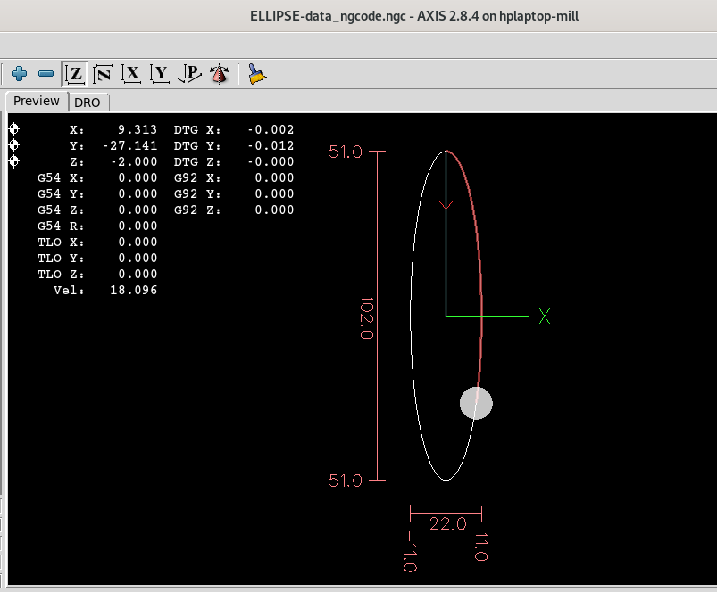

Bismillah Hirrahma Nirrahim
# CNC-Execution-Plan

# CNC Electrical Signals Validation

The ngcode for letters KSG has lines (G01) and curves.(G02 and G03). 

The LED bank above is a quick check for electrical signals for the X, Y and Z axes.

Wassalam.
WRY
